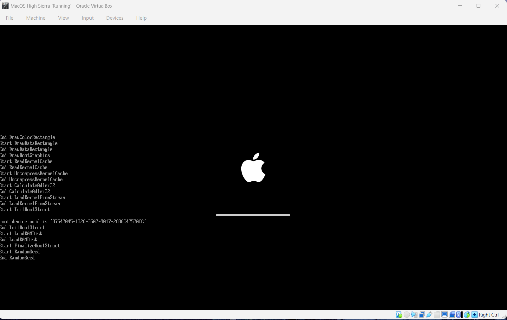
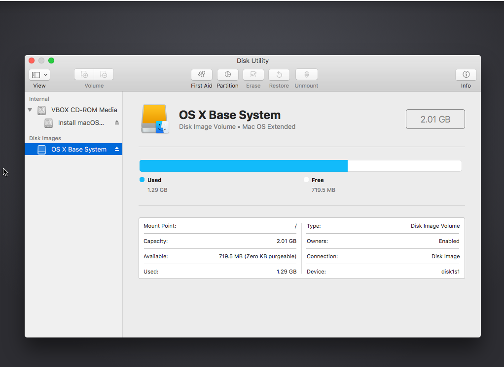
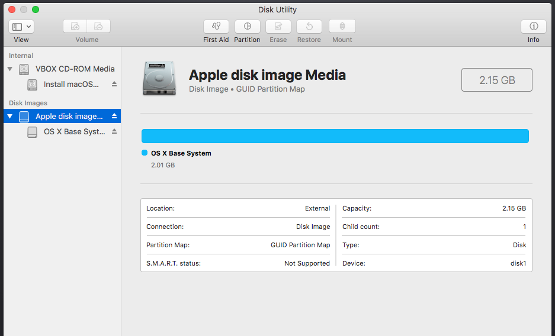
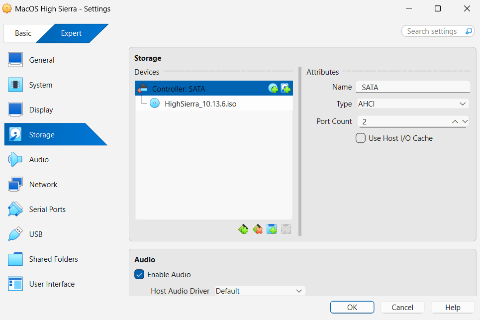
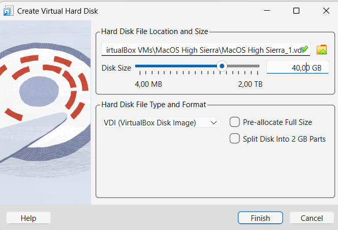
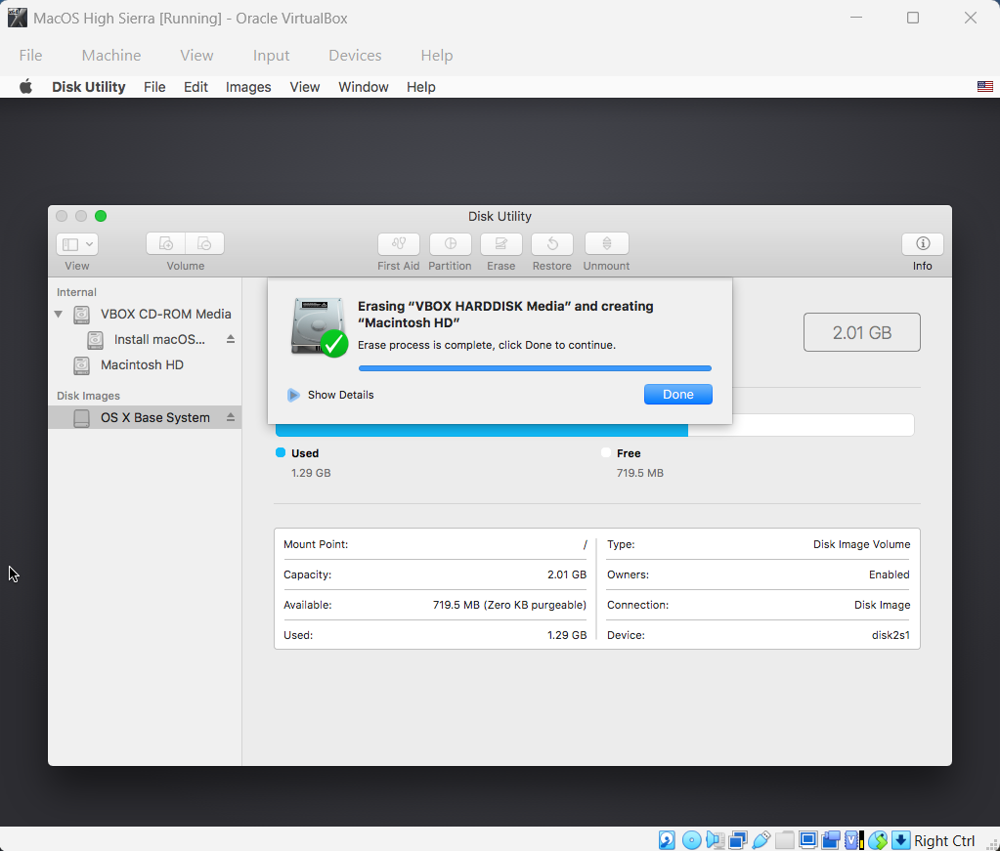
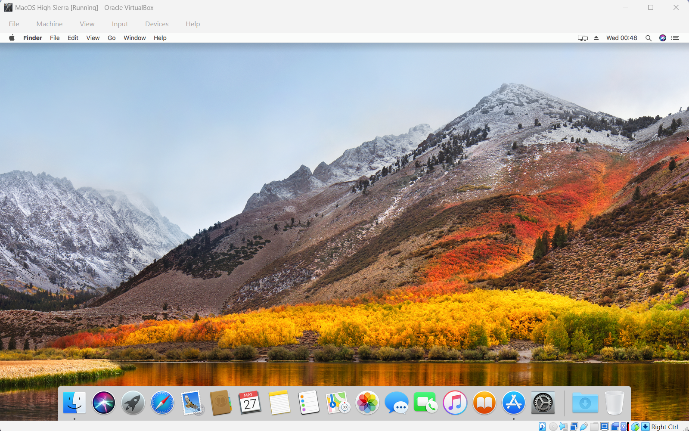

# macOS High Sierra on VirtualBox (Windows Host)

A complete step-by-step guide and proof of concept for running a fully functional **macOS High Sierra (10.13.6)** virtual machine inside **Oracle VirtualBox** on a Windows host. This README documents the troubleshooting steps taken to bypass common boot errors, host virtualization conflicts, and drive installation roadblocks.

---

## 📸 Installation & Troubleshooting Journey (Step-by-Step Proof)

Below are the 8 screenshots documenting the journey from the initial boot freezes to the final working macOS desktop configuration.

### Phase 1: Overcoming Boot Errors & Crashing
#### 1. The Initial Roadblock (`End RandomSeed`)
*The boot process consistently hung at the `End RandomSeed` line because VirtualBox failed to automatically hand over control to the macOS kernel.*


#### 2. Bypassing the Kernel Freeze
*By running the proper Intel Core i7 profile spoof command via Command Prompt, the text screen finally cleared and initialized the macOS setup environment.*


---

### Phase 2: Resolving Missing Hard Drive Errors
#### 3. The Hidden Drive Issue
*Inside Disk Utility, the native virtual hard disk was completely missing from the sidebar, preventing any installation progress.*


#### 4. Greyed Out Erase Menu
*The "Erase" button remained unclickable because the system was only recognizing the active installation recovery media.*


#### 5. Building the SATA Controller
*Shut down the VM and manually configured a dedicated `Controller: SATA` profile inside the VirtualBox storage layout manager.*


#### 6. Allocating Virtual Disk Space
*Created a new 40GB Dynamically Allocated VirtualBox Disk Image (`.vdi`) to serve as the main internal system storage.*


---

### Phase 3: Finalizing Formatting and Desktop Boot
#### 7. Formatting the Drive via Disk Utility
*Booted back into macOS, unhid all devices, and formatted the new `VBOX HARDDISK Media` using the `Mac OS Extended (Journaled)` structure.*


#### 8. Successful Installation Landmark
*The final operating system installation finished successfully, completely bypassing the iCloud 2FA login loops to load the main macOS desktop.*


---

## 🛑 Mitigating Windows Host Conflicts (Hyper-V)

Windows features like Hyper-V frequently lock the hardware virtualization extensions (`VT-x/AMD-V`), causing VirtualBox to trigger an instant boot loop panic on the guest macOS kernel. Ensure the following environmental changes are applied to your Windows host machine:

### Disabling Windows Hypervisor Conflicts
1. Press `Win + R`, type `optionalfeatures.exe`, and hit **Enter**.
2. Scroll down and **uncheck** the following conflicting features:
   * **Hyper-V**
   * **Virtual Machine Platform**
   * **Windows Hypervisor Platform**
3. Click **OK**, let Windows apply the updates, and **restart your computer**.

---

## 🛠️ Complete Terminal Command Scripts Applied

To replicate this exact environment on your Windows host, run the following commands inside an elevated Windows Command Prompt (`cmd`) with VirtualBox completely closed:

```cmd
cd "C:\Program Files\Oracle\VirtualBox"

:: 1. Spoof Compatible Intel Processor Architecture
VBoxManage modifyvm "MacOS High Sierra" --cpu-profile "Intel Core i7-6700K"

:: 2. Inject Required Apple System Management Controller (SMC) Keys
VBoxManage setextradata "MacOS High Sierra" "VBoxInternal/Devices/smc/0/Config/DeviceKey" "ourhardworkbythesewordsguardedpleasedontsteal(c)AppleComputerInc"
VBoxManage setextradata "MacOS High Sierra" "VBoxInternal/Devices/smc/0/Config/GetKeyFromRealSMC" 1
VBoxManage setextradata "MacOS High Sierra" "VBoxInternal/Devices/efi/0/Config/DmiSystemProduct" "iMac11,3"
VBoxManage setextradata "MacOS High Sierra" "VBoxInternal/Devices/efi/0/Config/DmiSystemVersion" "1.0"
VBoxManage setextradata "MacOS High Sierra" "VBoxInternal/Devices/efi/0/Config/DmiBoardProduct" "Iloveapple"

:: 3. Set Custom VESA Widescreen Resolution
VBoxManage setextradata "MacOS High Sierra" VBoxInternal2/EfiGraphicsResolution 1600x900
```
