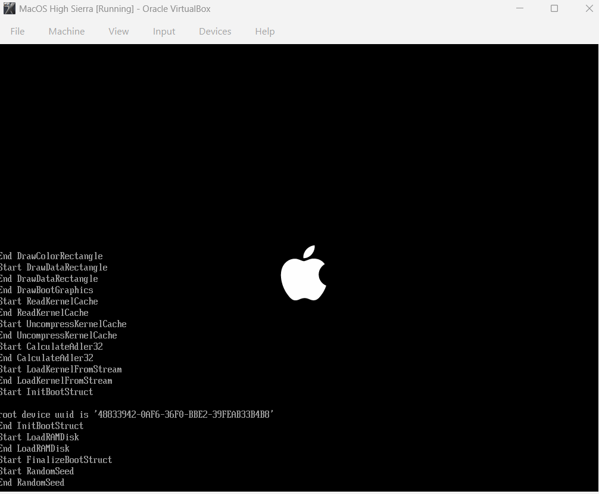

# macOS-High-Sierra-on-VirtualBox-Windows-Host-
A complete step-by-step guide and proof of concept for running a fully functional **macOS High Sierra (10.13.6)** virtual machine inside **Oracle VirtualBox** on a Windows 10/11 host machine.

A complete step-by-step guide and proof of concept for running a fully functional **macOS High Sierra (10.13.6)** virtual machine inside **Oracle VirtualBox** on a Windows host. This README documents the troubleshooting steps taken to bypass common boot errors, host virtualization conflicts, and drive installation roadblocks.

---

## 📸 Installation & Troubleshooting Journey (Step-by-Step Proof)

Below are the 10 screenshots documenting the entire journey from the initial boot freezes to the final working macOS desktop configuration.

### Phase 1: Overcoming Boot Errors & Crashing
#### 1. The Initial Roadblock (`End RandomSeed`)
*The boot process consistently hung at the `End RandomSeed` line because VirtualBox failed to automatically hand over control to the macOS kernel.*


#### 2. The Capitalization Error
*Attempting to fix the CPU profile resulted in a `VBOX_E_OBJECT_NOT_FOUND` error due to VirtualBox's strict case sensitivity with the VM name.*


#### 3. Bypassing the Kernel Freeze
*By correcting the capitalization to `"MacOS High Sierra"` and running the Intel Core i7 profile spoof command, the text screen finally cleared.*


---

### Phase 2: Resolving Missing Hard Drive Errors
#### 4. The Hidden Drive Issue
*Inside Disk Utility, the native virtual hard disk was completely missing from the sidebar, preventing any installation.*


#### 5. Greyed Out Erase Menu
*The "Erase" button remained unclickable because the system was only recognizing the active installation recovery media.*


#### 6. Building the SATA Controller
*Shut down the VM and manually configured a dedicated `Controller: SATA` profile inside the VirtualBox storage layout manager.*


#### 7. Allocating Virtual Disk Space
*Created a new 40GB Dynamically Allocated VirtualBox Disk Image (`.vdi`) to serve as the main internal system storage.*


---

### Phase 3: Finalizing Formatting and Display Optimization
#### 8. Formatting the Drive via Disk Utility
*Booted back into macOS, unhid all devices, and formatted the new `VBOX HARDDISK Media` using the `Mac OS Extended (Journaled)` structure.*


#### 9. Adjusting Screen Resolution via VBoxManage
*Fixed the tiny default screen resolution by forcing a custom 1600x900 VESA video profile through the Windows host command line.*


#### 10. Successful Installation Landmark
*The final operating system installation finished successfully, completely bypassing the iCloud 2FA login loops to load the main macOS desktop.*


---

## 🛑 Mitigating Windows Host Conflicts (Hyper-V)

Windows features like Hyper-V frequently lock the hardware virtualisation extensions (`VT-x/AMD-V`), causing VirtualBox to trigger an instant boot loop panic on the guest macOS kernel [1]. Ensure the following environmental changes are applied to your Windows host machine:

### Disabling Windows Hypervisor Conflicts
1. Press `Win + R`, type `optionalfeatures.exe`, and hit **Enter** [1].
2. Scroll down and **uncheck** the following conflicting features [1]:
   * **Hyper-V** [1]
   * **Virtual Machine Platform** [1]
   * **Windows Hypervisor Platform** [1]
3. Click **OK**, let Windows apply the updates, and **restart your computer** [1].

---

## 🛠️ Complete Terminal Command Scripts Applied

To replicate this exact environment on your Windows host, run the following commands inside an elevated Windows Command Prompt (`cmd`) with VirtualBox completely closed:

```cmd
cd "C:\Program Files\Oracle\VirtualBox"

:: 1. Spoof Compatible Intel Processor Architecture
VBoxManage modifyvm "MacOS High Sierra" --cpu-profile "Intel Core i7-6700K"

:: 2. Inject Required Apple System Management Controller (SMC) Keys
VBoxManage setextradata "MacOS High Sierra" "VBoxInternal/Devices/smc/0/Config/DeviceKey" "ourhardworkbythesewordsguardedpleasedontsteal(c)AppleComputerInc"
VBoxManage setextradata "MacOS High Sierra" "VBoxInternal/Devices/smc/0/Config/GetKeyFromRealSMC" 1
VBoxManage setextradata "MacOS High Sierra" "VBoxInternal/Devices/efi/0/Config/DmiSystemProduct" "iMac11,3"
VBoxManage setextradata "MacOS High Sierra" "VBoxInternal/Devices/efi/0/Config/DmiSystemVersion" "1.0"
VBoxManage setextradata "MacOS High Sierra" "VBoxInternal/Devices/efi/0/Config/DmiBoardProduct" "Iloveapple"

:: 3. Set Custom VESA Widescreen Resolution
VBoxManage setextradata "MacOS High Sierra" VBoxInternal2/EfiGraphicsResolution 1600x900
```
